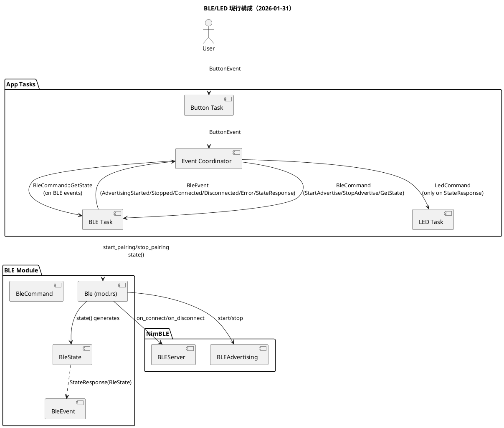

ESP32 DevKit V1 (Rust + ESP-IDF)
=================================

概要
----
ESP32 DevKit V1 向けの BLE + LED 制御サンプルです。
ボタン入力でアドバタイズ開始、BLE接続状態に応じて LED を制御します。

特徴
----
- BLE アドバタイズ開始/停止
- 接続/切断イベントの通知
- BLE 状態に応じた LED 制御
- 状態は `Ble` 構造体が一元管理

構成図 (PlantUML)
-----------------


ビルド
------
```bash
cargo build
```

実行
----
```bash
cargo run
```
